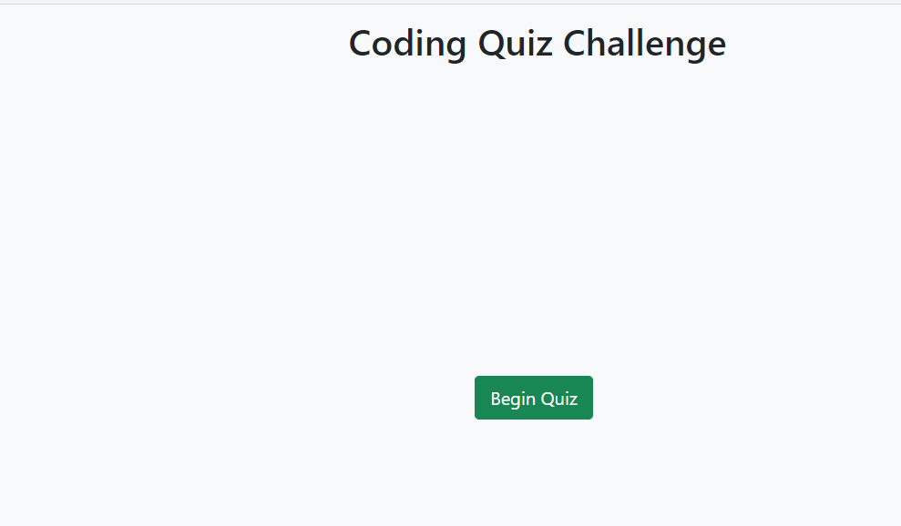
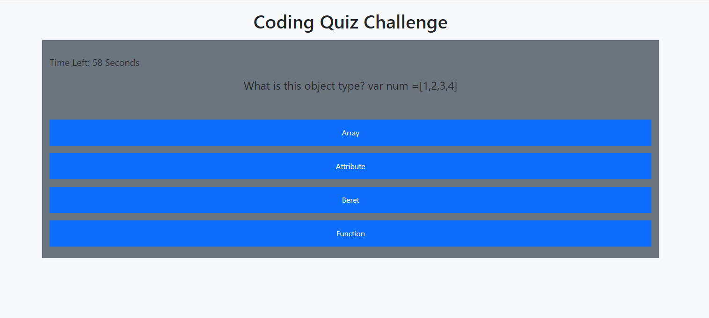
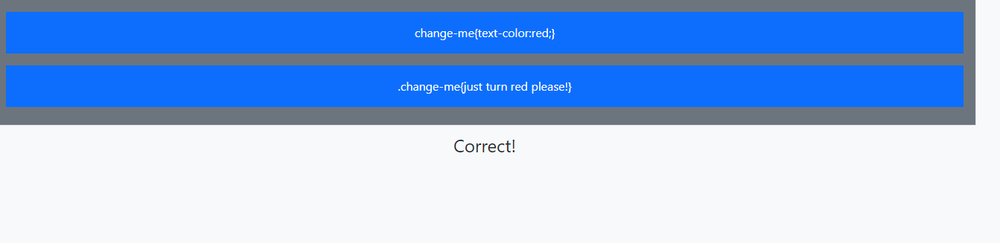
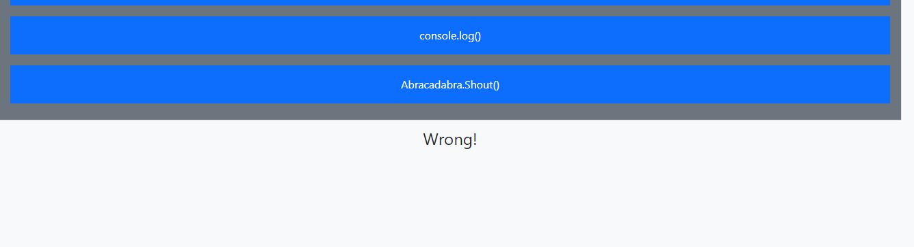
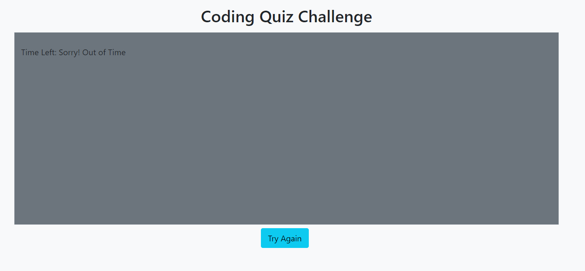
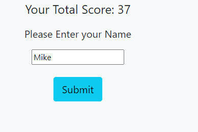
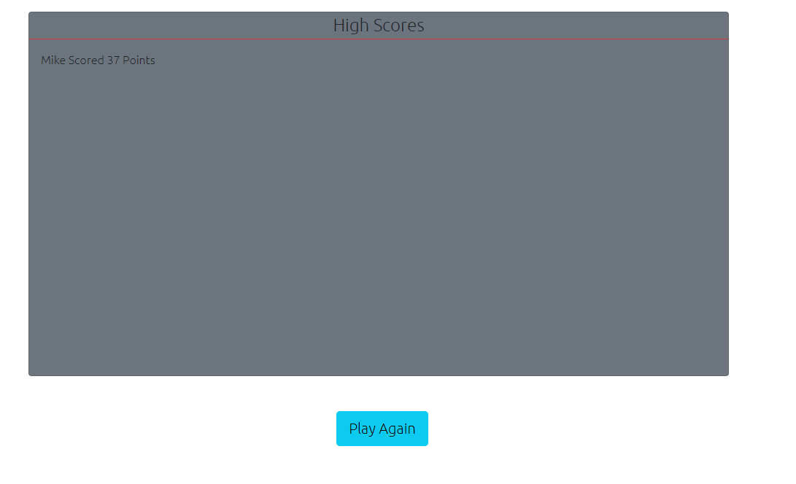

# JavaScript Coding-Quiz

This is a simple quiz game created with Vanilla JavaScript and Bootstrap.

Deployed URL: https://lelandcypress.github.io/Coding-Quiz/

## User Experience

1. Once the end user clicks on the Begin Quiz button

   

1. The User will be given a total of 60 seconds cycle through a series of questions testing their knowledge of coding. Each question is randomly sorted and dynamically updated via DOM methods.

   

1. If the user guesses correctly, they will receive a message at the bottom of the quiz card displaying "Correct", and be rewarded with 5 extra seconds.

   

1. If the user guesses incorrectly, they will receive a "Wrong!" message, and be penalized 5 seconds.

   

1. If the user runs out of time, the quiz will end and the user is given the option to restart.

   

1. At the end of the quiz the user will recieve their score, based on how many seconds were remaining. They will be prompted for their name.

   

1. Once they click "Submit" they will be taken to a seperate page, which displays their high scores, pulled from local storage. They will have the option of playing again.

   
